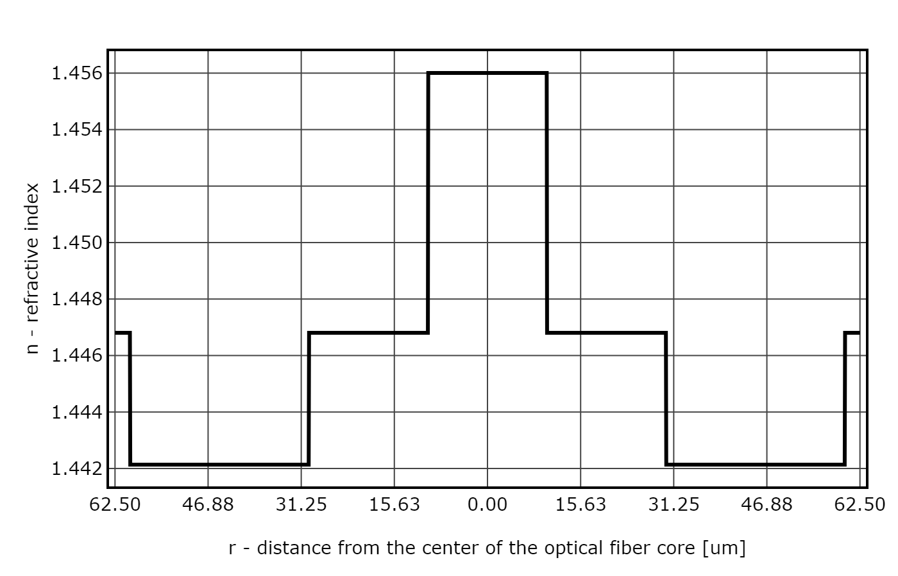

	
	 
	<strong>Telecommunications Optical Fibers Modeling Application</strong>

## Screenshots

## Bibliography
1. Torbus S. A.: Projektowanie światłowodów jednomodowych dla celów metrologicznych i ich zastosowanie w czujnikach faradaya. Wydawnictwa Uczelniane UTP w Bydgoszczy, Bydgoszcz 2014 [DOWNLOAD](tofma/src/pdf/Torbus_PSJDCMIIZWCF.pdf)
2. Torbus S. A., Dutkiewicz P.: Projektowanie jednomodowych światłowodów telekomunikacyjnych dla czujników wykorzystujących magnetooptyczne zjawisko Faradaya. Przegląd Elektrotechniczny Nr 2/2015 [DOWNLOAD](tofma/src/pdf/Torbus_Dutkiewicz_PJSTDCWMZF.pdf)
3. Torbus S. A., Fajfer M., Ratuszek M. J.: Projektowanie jednomodowych światłowodów telekomunikacyjnych odpornych na zginanie G.657 dla celów metrologicznych. Przegląd Elektrotechniczny Nr 8/2013 [DOWNLOAD](tofma/src/pdf/Torbus_Fajfer_Ratuszek_PJSTONZG.657DCM.pdf)
